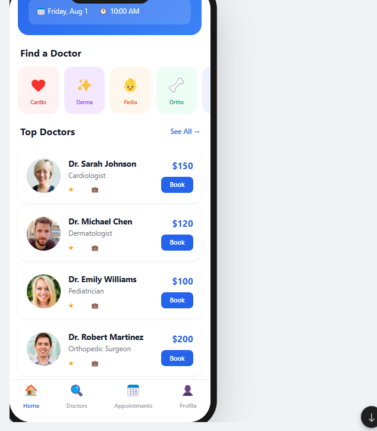
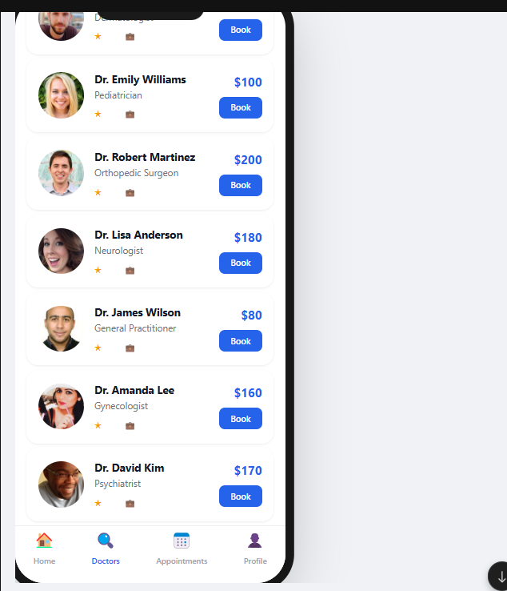
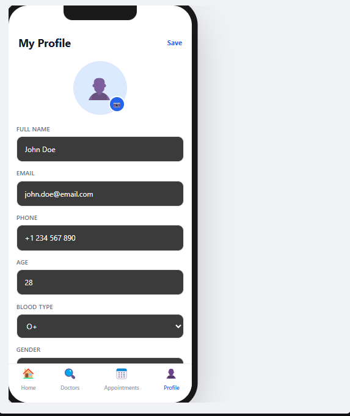
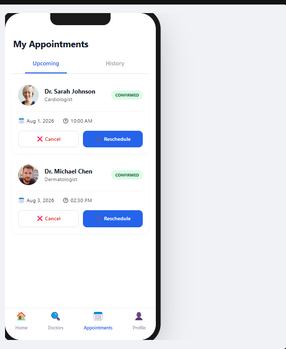

# 🩺 MedBook - Medical Appointment App

<p align="center">
  
  
  
  
</p>

<p align="center">
A modern Flutter application for booking and managing medical appointments with an elegant UI and smooth user experience.
</p>

---

## ✨ Features

### 🏠 Home Dashboard
- Beautiful and modern dashboard
- Upcoming appointment card
- Medical specialty categories
- Top doctors recommendations
- Quick navigation

### 👨‍⚕️ Doctors
- Browse available doctors
- Search by doctor name
- Filter by specialty
- View doctor information
- Book appointments instantly

### 📅 Appointment Management
- View upcoming appointments
- Appointment history
- Appointment status
- Cancel appointments
- Reschedule appointments

### 👤 User Profile
- Edit personal information
- Update contact details
- Manage blood type
- Gender selection
- Profile picture

### ⚡ Other Features
- Clean Material Design UI
- Responsive layout
- Mock local data
- Offline functionality
- Easy to extend with backend APIs

---

# 📱 Screenshots

| Home | Appointments |
|------|--------------|
|  |  |

| Profile | Appointments (Details) |
|---------|------------------------|
|  |  |

---

# 🚀 Getting Started

## Prerequisites

- Flutter SDK
- Dart SDK
- Android Studio or VS Code
- Android Emulator / Physical Device

Verify Flutter installation:

```bash
flutter doctor
```

---

## Installation

Clone the repository

```bash
git clone https://github.com/yourusername/medbook.git
```

Navigate into the project

```bash
cd medbook
```

Install dependencies

```bash
flutter pub get
```

Run the application

```bash
flutter run
```

---

# 📂 Project Structure

```
medbook/
│
├── lib/
│   ├── main.dart
│   ├── models/
│   ├── screens/
│   ├── widgets/
│   ├── services/
│   └── utils/
│
├── screenshots/
│   ├── home.png
│   ├── appointments.png
│   ├── appointments2.png
│   └── profile.png
│
├── assets/
├── pubspec.yaml
├── analysis_options.yaml
└── README.md
```

> **Note:** If your project currently contains everything inside `main.dart`, you can keep it that way. The above structure is recommended for future expansion.

---

# 🛠 Built With

- 💙 Flutter
- 🎯 Dart
- 📱 Material Design

---

# 📌 Future Improvements

- 🔐 User Authentication
- ☁️ Firebase Integration
- 💳 Online Payments
- 🔔 Push Notifications
- 💬 Doctor Chat
- 🎥 Video Consultation
- 🌐 Multi-language Support
- 📄 Medical Records
- ⭐ Doctor Reviews
- 🗓 Calendar Synchronization

---

# 📦 Backend

This project currently uses **mock data** and **local in-memory state management**, allowing it to work completely offline.

To use it in production, you can integrate:

- Firebase
- Supabase
- Node.js + Express
- Django REST Framework
- Laravel
- Spring Boot

---

# 🤝 Contributing

Contributions, issues, and feature requests are welcome!

1. Fork the project
2. Create a feature branch

```bash
git checkout -b feature/AmazingFeature
```

3. Commit your changes

```bash
git commit -m "Add AmazingFeature"
```

4. Push the branch

```bash
git push origin feature/AmazingFeature
```

5. Open a Pull Request

---

# ⭐ Support

If you found this project helpful, consider giving it a **⭐ Star** on GitHub.

It helps others discover the project!

---

<p align="center">
Made with ❤️ using Flutter
</p>
